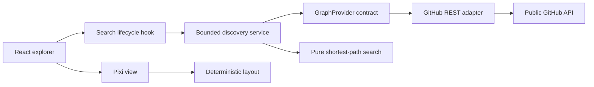

# Architecture and feasibility

## Feasible product, bounded claims

GitHub exposes public follows and followers. Those edges can be searched to discover possible chains of introduction. GitHub's API does not expose a verified professional referral network, and a follow alone is weak social evidence. The UX therefore describes public follows, preserves their direction, identifies fictional demo data, and never claims that an introduction is assured.

Linus Torvalds's GitHub handle is `torvalds`. High-profile accounts are difficult destinations for a cold graph crawl: follower lists can span thousands of pages. Exhaustive crawling under anonymous API quotas is not a viable real-time product promise.

## Why PixiJS

This is a navigation and reading problem on a graph. Two dimensions keep names, hop counts and direction legible. Pixi supplies accelerated rendering, picking and scene containers without a 3D camera, lighting or occlusion problem. React owns the controls and accessible text; Pixi owns graphics resources. Three.js would make sense if spatial depth became a meaningful part of the data, which it currently is not.

## Boundaries

The search service accepts a provider and an AbortSignal. It does not import React, Pixi, browser storage or the GitHub adapter. The pure graph functions are testable with deterministic in-memory evidence. A future indexed provider can replace the HTTP adapter without rewriting pathfinding or the UI.

The current service alternates breadth-first discovery from both ends. From the source it requests `following`; from the destination it requests `followers`, storing each returned edge as `follower → destination`. After each expansion it checks the accumulated directed graph for a path. It can stop as soon as it finds one. Alternating expansions and sampled pages do not prove a globally shortest path; only the pure BFS over the observed graph has that guarantee.

## Resource policy

- At most 24 HTTP requests, 22 expansions and 400 nodes per search. Each expansion returns at most the first 100 accounts. Edges are deduplicated.
- Sequential requests avoid bursts; no automatic retries consume additional quota. A 12-second request timeout bounds hangs.
- The adapter validates payloads using Zod before cache insertion. The cache holds at most 256 endpoint responses with a five-minute TTL. It is memory-only and scoped to the browser page, not persisted across reloads.
- Rate-limit headers update the available quota. A session-wide cooldown honors reset and retry delays across subsequent searches. GitHub is still the authority across tabs, reloads, browsers and users sharing an IP.
- Cancellation propagates to fetch; a generation counter prevents old searches from overwriting a newer search or the demo. Partial discovered evidence remains visible after cancellation or an error.
- Pixi initializes only on the client, loads separately, retains keyed nodes and edges across updates, animates discovery and camera changes, runs a short route-tracing celebration, then stops the ticker, and removes pointer listeners, observers and graphics resources on disposal. Text paths and a developer list remain usable without WebGL.

## Deliberate limits of this first implementation

There is no durable graph database, OAuth, shared backend API cache, ranked referee score, social contact enrichment or automatic outreach. Profiles can be private, API data can change, and page sampling is biased toward GitHub's endpoint ordering. The 400-node cap is a product resource guard, not an assertion about Pixi's maximum capacity. Results are exploratory and not a benchmark of exhaustive graph search.

Current layout prioritizes a readable path and a stable surrounding network. For thousands of visible nodes, move incremental force layout and search to Web Workers, cluster communities at low zoom, and draw labels only at appropriate zoom levels. Benchmark those changes with realistic graphs before raising limits.

## Scaling into a production discovery service

1. **GitHub App authentication and a server adapter.** Keep installation/user tokens on the server, minimize scopes, and enforce per-user and shared budgets. Authenticated personal REST requests generally permit 5,000 requests/hour, still subject to secondary limits. OAuth does not remove the need for caching or bounded work.
2. **A durable evidence store.** Store directed edges with `observed_at`, evidence type, source endpoint, and refresh state. Track completeness separately for every adjacency list; an incomplete list is not an empty list. Expire or revalidate edges, including deleted accounts and unfollows.
3. **A bounded ingestion queue.** Deduplicate jobs, checkpoint pagination, prioritize the two frontiers, honor GitHub backoff headers and cache validators, and publish incremental results to the UI. Never respond to quota exhaustion with parallel retries.
4. **Indexed searches.** For a moderate graph, PostgreSQL adjacency tables with indexes on `(source, target)` and `(target, source)` are sufficient. Introduce specialized graph infrastructure only after measurements show a need. Return an evidence snapshot and coverage metadata with each route.
5. **Additional relationship evidence, if desired.** Repository contributions or reviews could suggest stronger ties, but sharing a repository is not proof of interaction. Keep those edge types distinct, explain scores, and never silently turn collaboration evidence into a verified personal relationship.

## Security and privacy

The application only sends public usernames to `api.github.com`. It does not ask for or persist personal access tokens. No messages are sent to anyone. GitHub profile URLs are generated from validated/encoded handles. Sites hosting keeps the preview private to its owner; that access gate is separate from GitHub API authentication.
