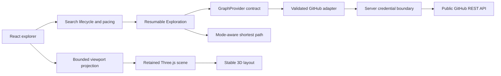

# Architecture and feasibility

## Product semantics

The product is an immersive 3D exploration of **directed public follows**, not a verified referral database. `a → b` means account a follows account b. Each edge retains its observed direction in storage. Default route traversal accepts follows in either direction; mutual mode only traverses pairs with both observed follows. The text path and evidence inspector are authoritative; spatial distance is a layout choice, not relationship strength.

Linus Torvalds's GitHub handle is `torvalds`. A follow is a possible lead, not proof that someone knows him or can introduce you.

## Separation of concerns

Three.js owns rendering and navigation. React owns readable controls, lifecycle and accessible text. Domain code imports neither. Replacing the HTTP provider with an indexed service does not require rewriting path search or the renderer.

## Exploring all public pages

`Exploration` maintains two queues rooted at the source and destination. Both queues explore followers and following lists in either-direction and mutual modes. Each queue item contains an account, list direction, depth and next page. Mutual mode explores the either-direction neighborhood as a superset, then requires reciprocal evidence when searching for a route. This is complete within the requested boundary but can inspect more pages than a specialized mutual-only crawler. A successful response commits evidence and advances that cursor. A failed or cancelled response commits nothing, so retrying cannot skip a page. Each direction deduplicates its queued account lists. Pagination continues through `Link: rel="next"` until a list is exhausted. Expansion stays within the selected 2–6 hop boundary.

A found path does not stop exploration. Breadth-first search over observed edges continually returns the shortest valid path for the selected connection mode within that evidence and hop ceiling. Sampling no longer truncates API adjacency lists at page one. Completeness means the requested public neighborhoods have been exhausted, not that all GitHub accounts have been crawled.

Entire-network exploration remains infeasible as a real-time anonymous promise: branching grows rapidly, GitHub data changes, private profiles are absent, and public requests normally share a 60/hour IP quota. The app pauses on quota exhaustion and retains its cursor. The reset/cooldown is enforced by the adapter across searches in this page. It does not automatically issue background requests after a reset; the user resumes explicitly.

## Pacing and lifecycle

Every fetched page receives a five-second visual sequence. The domain service performs one page at a time; the React lifecycle awaits an abortable delay between pages. Pacing does not fabricate accounts, affect path correctness, or request unnecessary data. Pausing during the sequence preserves already committed evidence and cancels the remaining timer.

A generation counter prevents older requests from overwriting a newer trace or the demo. Resume reuses the same exploration object with a new fetch controller. Memory-only cursors are intentionally lost on reload; durable sessions require a future storage layer.

## HTTP boundary

The adapter normalizes usernames, rejects invalid input and organization endpoints, validates responses with Zod before caching, limits each HTTP request to 12 seconds, and issues requests serially. Native fetch is called without binding it to the adapter. There are no automatic network retries.

The cache holds at most 256 responses for five minutes; hits do not extend freshness. `Link` determines pagination. Rate-limit headers update quota display; reset/retry delays establish a session-wide cooldown. Tokens are neither requested nor stored in the browser. All browser requests target `/api/github/*`. The proxy accepts only public profiles, followers, following and a sanitized quota status endpoint. It rejects writes, unknown paths and arbitrary query parameters, forbids upstream redirects, strips profile fields beyond the app schema and only forwards pagination/quota headers. Errors never echo transport exceptions or credentials.

The hosted Worker checks the Site viewer identity and retrieves that visitor's GitHub OAuth session. There is no shared token and no CLI-authentication fallback. The Site remains owner-private; GitHub connection never changes Site access policy.

`lib/github/auth/service.ts` owns public-data OAuth authorization, S256 PKCE, one-use state, same-origin POST validation, callback verification, account lookup, session replacement and logout. `D1AuthStore` uses prepared statements and atomically consumes callback state with `DELETE … RETURNING`. Tokens and PKCE verifiers use AES-GCM encryption with context binding; opaque cookie identifiers are hashed in storage. The cookie is HttpOnly, SameSite=Lax, Secure on HTTPS, and has no persistent Max-Age. The server enforces an eight-hour maximum or the provider token expiry, whichever comes first. No refresh token is retained. Disconnect invalidates the stored session, including replay of its old cookie. GitHub app authorization persists until the user revokes it in GitHub settings.

Status shows only username, expiry and quota. Invalid upstream credentials invalidate the local session. Missing setup is visible without exposing secrets. OAuth and storage failures are sanitized at the route boundary. Expired rows are purged on new authorization attempts. For a public multi-user deployment, add per-user authorization-start rate limits and scheduled expiry cleanup before increasing access.

## The 3D scene

Actual developer nodes have stable spherical coordinates, including route members. They never launch from a common origin or move when a route is found. Each new node gets an independent random delay and fade duration (800–2400 ms), completing within the five-second batch. Reveals survive later graph snapshots without restarting. Full-length edges fade according to the lesser opacity of their two endpoints. Invisible signals cannot be selected. A custom point shader renders bright centers and soft glows in one draw call. Background stars supply parallax and are explicitly decorative.

A retained `SpaceScene` survives incoming batches. Perspective camera navigation includes orbit, dolly, keyboard translation, node picking/focus, and a route tour. Manual controls cancel camera flights. Labels are camera-facing sprites. The route marker indicates traversal order; the evidence inspector preserves actual follow direction. spatial proximity carries no social meaning.

The scene disposes textures, materials, buffers, controls, event listeners, observers and its animation frame on teardown. Reduced-motion preferences bypass camera interpolation and disable decorative movement. Explicit manual navigation remains available.

## Rendering budget versus discovery budget

Data discovery no longer stops at 400 nodes. To keep rendering predictable, `visibleGraph` selects at most 600 nodes and 5,000 edges, preserving route evidence and prioritizing recent nodes. It never mutates or deletes the complete observed graph. A bounded retirement overlap accommodates fading nodes. All accounts remain accessible through the paginated text list.

Very long sessions can still accumulate substantial browser memory. This implementation is a single-tab explorer, not a durable whole-network index. Before offering unattended or multi-day exploration, add persistent storage, eviction policies and server-managed jobs. Benchmark real graphs before increasing GPU budgets.

## Production scaling

1. **Multi-user authentication and budgets:** evolve the current server token into a GitHub App provider; enforce per-user and shared budgets before expanding access. Authenticated personal REST requests generally allow 5,000/hour but still have secondary limits.
2. **Durable evidence and cursor store:** preserve directed edges with observation times and provenance. Track per-list completeness, page cursors and refresh state separately. An incomplete list is never equivalent to an empty one.
3. **Bounded ingestion queue:** deduplicate work, checkpoint pages, respect cooldowns, refresh stale edges and stream committed batches to clients. Never answer quota errors with bursts of retries.
4. **Indexed graph search:** PostgreSQL adjacency indexes are sufficient for a moderate graph. Use specialized infrastructure only after measurement. Return coverage and snapshot metadata alongside routes.
5. **Larger 3D scenes:** move layout/search off the main thread, cluster distant communities and use label level-of-detail. Keep a text route and accessible controls available.

Repository co-contribution or review evidence could be added later, but must remain distinct from follows. Sharing a repository alone does not establish that two people know one another. No automated outreach is implemented.
